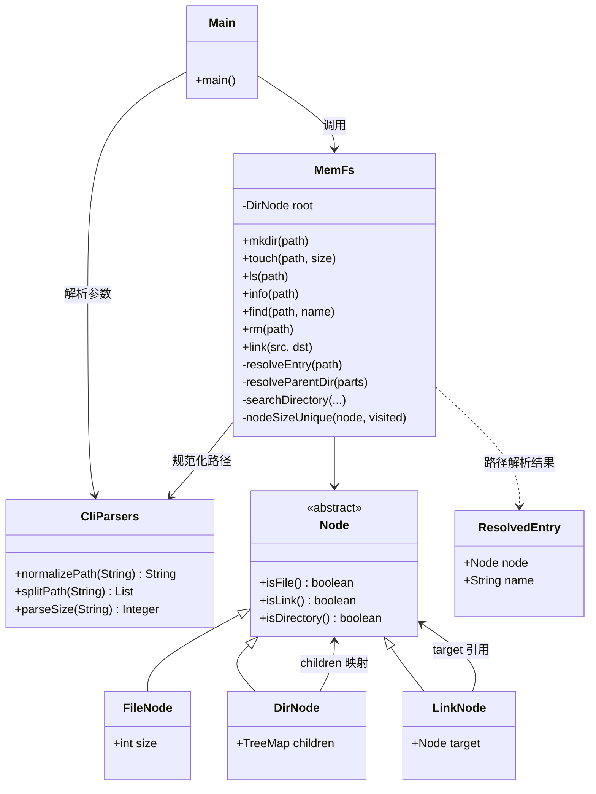
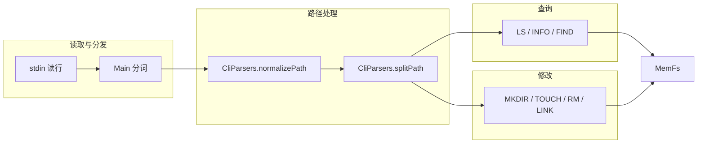

# 系统架构设计文档

## 1. 小组信息

- Gradescope 账号 name：曾闻天
- Gradescope 账号邮箱：231880147@smail.nju.edu.cn
- 组员：231880147 - 曾闻天

## 2. 系统目标与范围

本程序实现一个**纯内存、单根目录**的微型文件系统：从标准输入逐行读取命令，将查询类命令的结果写入标准输出；所有状态保存在进程内存中，不持久化。迭代一与迭代二共用这一总体目标，但能力范围逐步扩展。

### 2.1 迭代一

#### 目标

建立最小可用的内存文件系统，支持目录与文件的创建、列出与大小查询，验证基本的树形路径导航与聚合统计。

#### 支持的命令

| 命令 | 作用 |
|------|------|
| `MKDIR <path>` | 在已存在的父目录下创建子目录 |
| `TOUCH <path> <size>` | 在已存在的父目录下创建文件并设置大小 |
| `LS <path>` | 列出路径对应节点：文件输出自身名，目录输出直接子项名 |
| `INFO <path>` | 输出节点大小 |

#### 数据模型

- 仅两类节点：**文件（FileNode）**、**目录（DirNode）**。
- 单根目录 `/`；目录用 `TreeMap<String, Node>` 保存子项，按名称字典序遍历。
- 文件保存非负整数 `size`；目录大小为其子树内所有文件大小之和（简单递归累加，无去重需求）。

#### 路径规则

- 路径必须为**绝对路径**（以 `/` 开头）。
- **不支持**路径规范化：路径中不得出现连续 `//`、`.`、`..`，非根路径不得以 `/` 结尾；否则整条命令忽略。
- 由 `CliParsers.isValidPath` 校验，`splitPath` 按 `/` 分段。

#### 核心行为摘要

- `MKDIR`：父目录不存在、中间路径为文件、目标已是目录时忽略；目标已是文件时可替换为目录。
- `TOUCH`：父目录不存在或中间路径为文件时忽略；目标存在时一律用新文件覆盖（含目录项）。
- `LS` / `INFO`：路径不存在时忽略；无链接，路径解析不跟随任何别名。
- 不允许在根路径 `/` 上创建文件或目录。

### 2.2 迭代二

#### 目标

在迭代一基础上，使系统更接近真实文件系统的路径处理与节点操作：支持路径规范化、符号链接、递归搜索、删除，以及更细粒度的覆盖与大小统计规则。

#### 支持的命令

在迭代一既有命令（`MKDIR`、`TOUCH`、`LS`、`INFO`）基础上，新增并扩展如下：

| 命令 | 作用 |
|------|------|
| `MKDIR <path>` | 创建目录；可与文件/链接互相替换；已存在普通目录则不变 |
| `TOUCH <path> <size>` | 创建或更新文件；已存在普通文件仅改大小；可替换目录/链接 |
| `LS <path>` | 支持链接：链到文件输出链接名，链到目录列出目标子项 |
| `INFO <path>` | 支持链接；目录统计时对共享底层节点去重 |
| `FIND <path> <name>` | **新增**：递归按名称查找，输出匹配的绝对路径 |
| `RM <path>` | **新增**：删除文件、链接或空目录 |
| `LINK <src> <dst>` | **新增**：在目标路径创建指向源节点的共享链接 |

#### 数据模型

在迭代一两类节点基础上，增加第三类：

- **链接（LinkNode）**：目录项名称独立存储，节点内仅持 `target` 引用，指向已存在的文件/目录（经 `followLinks` 后的底层对象）；多路径共享同一底层节点，不复制内容。

#### 路径规则

- 仍为绝对路径；非绝对路径整条命令忽略。
- **所有命令先经 `CliParsers.normalizePath` 规范化**再执行：
  - 冗余 `/` 合并；`.` 忽略；`..` 回退父级（根的父级仍为 `/`）；
  - 非根路径允许末尾 `/`，规范化后去除。
- 示例：`/a//b/./c/../` → `/a/b`。

#### 核心行为摘要（相对迭代一的变化）

| 能力 | 迭代一 | 迭代二 |
|------|--------|--------|
| 路径 | 严格字面路径 | 规范化后解析 |
| 节点类型 | 文件、目录 | 文件、目录、链接 |
| 大小统计 | 子树简单求和 | 链接共享时按对象引用去重 |
| 搜索 | 无 | `FIND` 递归 + 链接目录防重复展开 |
| 删除 | 无 | `RM`（仅空目录可删，删链接不影响目标） |
| 覆盖 | `TOUCH` 一律覆盖 | 分类型：如已有目录 `MKDIR` 不变、已有文件 `TOUCH` 只改 size |
| 经链接写路径 | 不适用 | 中间/父路径跟随链接，写入底层目录 |

非法命令、参数错误、前置条件不满足时，与迭代一相同：**无输出、不改变状态**。

## 3. 核心架构

系统采用**三层结构**：命令分发层、路径工具层、文件系统核心层。核心层内部用多态节点类型统一表示文件系统对象。



### 3.1 模块职责

| 模块 / 类 | 职责 |
|-----------|------|
| **Main** | 从 `stdin` 读行，按空白分词，校验参数个数后分发到 `MemFs`；查询命令逐行打印结果。 |
| **CliParsers** | 路径规范化、`splitPath` 分段、`parseSize` 校验非负整数。不持有文件系统状态。 |
| **MemFs** | 文件系统唯一状态持有者；实现全部命令语义与路径解析、遍历、去重逻辑。 |
| **Node / FileNode / DirNode / LinkNode** | 领域模型；通过 `isFile` / `isLink` / `isDirectory` 区分行为分支。 |
| **ResolvedEntry** | 一次路径查找的返回值：末级目录项对应的 `node` 与目录项名称 `name`（用于 `LS` 输出链接名）。 |

### 3.2 命令与逻辑划分



- **查询逻辑**：`resolveEntry` 定位节点；`LS` 对链接区分“输出链接名”与“列出目标目录子项”；`INFO` 经 `followLinks` 后调用 `nodeSizeUnique`；`FIND` 调用 `searchDirectory` 并最后 `Collections.sort`。
- **修改逻辑**：`resolveParentDir` 沿路径走到父目录（中间分量自动跟随链接）；在父目录的 `children` 上插入、替换或删除目录项。

## 4. 关键数据结构

### 4.1 目录与子节点

根目录为单例 `MemFs.root`（`DirNode`）。每个目录的子节点保存在：

```text
TreeMap<String, Node> children
```

- **键**：目录项名称（如 `usr`、`copy`），即该层路径分量。
- **值**：`FileNode`、`DirNode` 或 `LinkNode` 之一。
- 使用 `TreeMap` 保证 `LS` 与 `FIND` 输出天然按名称字典序。

### 4.2 文件大小

`FileNode` 持有字段 `int size`，由 `TOUCH` 创建或覆盖时写入。目录与链接不直接存储大小，大小由算法计算。

### 4.3 链接与共享

`LinkNode` 仅含 `Node target` 引用。`LINK` 时对源路径执行 `followLinks`，将**底层节点对象**存入 `target`，使多个路径目录项指向同一对象：

```text
/real  --> DirNode#1
/view  --> LinkNode --> DirNode#1   （同一对象）
```

对 `/view/b.txt` 执行 `TOUCH` 时，父目录解析会跟随链接落到 `DirNode#1`，文件实际挂在 `/real` 对应的子树上。

### 4.4 唯一标识与“名称 vs 节点”

实现**不显式分配**数值型 ID，而以 **Java 对象引用（identity）** 作为底层节点的唯一标识：

- `INFO` 去重：`Set<Node> visited`，同一对象第二次访问贡献 0。
- `FIND` 防重复展开：`Set<DirNode> expandedDirs`，同一 `DirNode` 对象只进入 `searchDirectory` 一次。

**目录项名称**与**底层节点**分离：

- 名称存在于父目录 `children` 的键，以及 `ResolvedEntry.name`。
- 节点是 `FileNode` / `DirNode` / `LinkNode` 对象；`LS` 对“链接到文件”输出的是**链接目录项名称**，而非目标文件名。

## 5. 关键算法与边界处理

### 5.1 路径规范化

`CliParsers.normalizePath` 流程：

1. 若路径不以 `/` 开头，返回 `null`（整条命令忽略）。
2. 扫描路径，按 `/` 切分片段，跳过空片段（合并冗余 `/`）。
3. `.` 忽略；`..` 弹出栈顶（栈空则不变，根目录父仍为根）。
4. 栈空则结果为 `/`；否则拼接为 `/a/b` 形式（无尾斜杠）。

所有命令入口先规范化；`splitPath` 仅处理已规范化路径。

### 5.2 路径解析：跟随链接 vs 保留链接

| 场景 | 行为 |
|------|------|
| 遍历路径中间分量（`resolveParentDir`） | 遇到 `LinkNode` 则 `followLinks` 到目标，要求目标为目录。 |
| 定位末级节点（`resolveEntry`） | 返回父目录中存储的节点本身（可能是 `LinkNode`）。 |
| `LS` / `INFO` / `FIND` 起点 | 使用 `ResolvedEntry`；链接在 `LS` 中按规则特殊处理。 |

### 5.3 INFO 去重

`nodeSizeUnique(node, visited)`：

1. `followLinks` 得到底层节点。
2. 若 `visited` 已含该对象，返回 0。
3. 文件：加入 `visited`，返回 `size`。
4. 目录：加入 `visited`，对每个子节点递归求和（子链接再次 `followLinks` / 去重）。

因此根目录下 `/data` 与 `/alias` 指向同一 `DirNode` 时，`INFO /` 只统计一份文件大小。

### 5.4 FIND 递归与排序

**起点分三种情况：**

- 文件：仅当末级名称等于 `name` 时加入结果。
- 链接到文件：可匹配链接名；不进入子树。
- 目录或链接到目录：可匹配自身名称，再 `searchDirectory` 搜索子树。

**`searchDirectory` 规则：**

- 进入目录前 `expandedDirs.add(dir)`，若已存在则直接返回（防止同一底层目录经不同链接重复搜索）。
- 普通子目录：路径为当前遍历路径 `dirPath/childName`。
- 子链接到目录：先匹配链接名；再 `canonicalPath(targetDir)` 得到该目录在树中的**规范路径**后继续搜索（跳过链接路径，避免路径混乱）。

全部结果收集后 `Collections.sort` 按字典序输出。

### 5.5 RM 规则

1. 规范化路径；不能删除 `/`。
2. 解析父目录与末级名称；节点不存在则忽略。
3. 若为**普通目录**（非链接）且 `children` 非空，忽略。
4. 文件、链接、空目录：从父目录 `children` 中 `remove`。
5. 删除链接**不影响** `target` 指向的底层节点。

### 5.6 覆盖语义

| 命令 | 已存在普通目录 | 已存在普通文件 | 已存在链接 |
|------|----------------|----------------|------------|
| `MKDIR` | 不变 | 替换为目录 | 替换为目录 |
| `TOUCH` | 替换为文件 | 仅更新 `size` | 替换为文件 |
| `LINK` | 替换为链接 | 替换为链接 | 替换为链接 |

不允许在根路径 `/` 上执行 `MKDIR`、`TOUCH`、`LINK` 创建或 `RM` 删除。

### 5.7 非法命令与失败操作

统一策略：**无错误输出、不改变状态**（对应当前命令的修改不生效）。

典型忽略条件：

- 未知命令或参数个数不匹配；
- `normalizePath` 返回 `null`；
- 父目录不存在或父路径不是目录；
- 目标路径不存在（`LS` / `INFO` / `FIND` / `RM`）；
- `parseSize` 失败（非整数或负数）；
- 删除非空目录；
- 对 `/` 的非法创建或删除。

`Main` 在参数不足时不调用 `MemFs`；`MemFs` 内部对前置条件不满足直接 `return`。

## 6. 测试说明

在 `Assignment02/submission/tests/` 下准备了多组标准输入，本地编译运行：

```bash
cd Assignment02/submission/src
javac *.java
Get-Content ..\tests\<用例>.txt | java Main
```

### 6.1 已覆盖场景

| 场景 | 用例文件 | 验证点 |
|------|----------|--------|
| 路径规范化 | `test1.txt` | `//`、`./`、`../`、尾 `/`；`INFO` 统计到正确目录 |
| 基础 FIND | `test_find1.txt` | 多层目录递归、字典序输出 |
| 链接到目录 | `test_link2.txt` | 经链接创建文件落在底层目录；`INFO` 合计正确 |
| 链接去重 | `test_info_link.txt` | `/data` 与 `/alias` 共享，`INFO /` 为 30 非 60 |
| 覆盖语义 | `test_replace.txt` | `LINK` 后 `TOUCH`/`MKDIR` 替换目录项不影响 `/x` |
| 删除 | `test_rm1.txt` | 删文件后删空目录；空 `LS` 无输出 |
| 综合 | `test_full.txt` | 规范化 + 链接 + `FIND` + `RM` 只删链接 |

### 6.2 测试结论

上述用例在本地与题目给出的标准输出一致。

Gradescope 自动测试在提交代码后由平台判定通过。